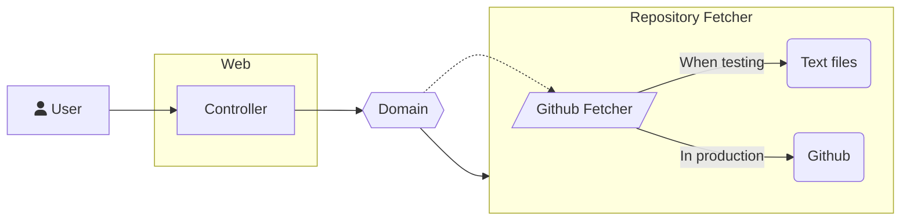

# Repo-stats architecture

## Overview

The application has been designed with Hexagonal Architecture in mind. The goal being
separation of responsabilities, testability and then be more maintaneable in time.

Here, the domain does not know who's calling him, neither does he know where the repository data is fetched.

The application has been developed in TDD, with acceptance tests.

## Structure

### `api` - Interface folder

This is where the API Doc lives. It is in the OpenAPI format, and you can explore it live 
with the [following link](https://editor.swagger.io/?url=https://raw.githubusercontent.com/bachrc/repo-stats/master/api/openapi.yml).

### `cmd` - The executables

The folder contains the executable parts of our program. Here we have just a web server, but we could wish other interfaces. Why not CLI ?

#### The `web` executable

Its responsability is only to launch the app, and construct the cores together. It gets the Github Fetcher, gives it to the domain, 
and the domain is given to the web entry. 

### `internal` - internal libraries

Here resides the libraries used for building the app. As said, there are three cores, 
each with its own responsability : **web**, **domain** and **github-fetcher**.

#### `web` - The Web Interface

Here lies the web logic. It also contains the acceptance tests, and the stubbing of the web calls. **If you read all the test names, 
you will know everything the application is capable of**.

My choice has been to not rely on a "magical framework" that could have solved any performance and concurrency problems, as it wasn't
the subject of the exercise.

#### `domain` - The Business logic

Separated from all the technical details, the domain is the intelligence of our app. Here, it is mainly to filter if asked.

#### `github-http-fetcher` - The interface with Github

Its role is to communicate with github. It has been made without importing the Github module, again wanting to follow the exercise
subject. This core is covered in the acceptance tests too, as it is the http calls that are mocked, not this module.

### `test` - Containing the test datas

This is where belong the test data used to mock the HTTP calls. It also contains the  file used to fetch 
the data, and then store it inside the folder.
